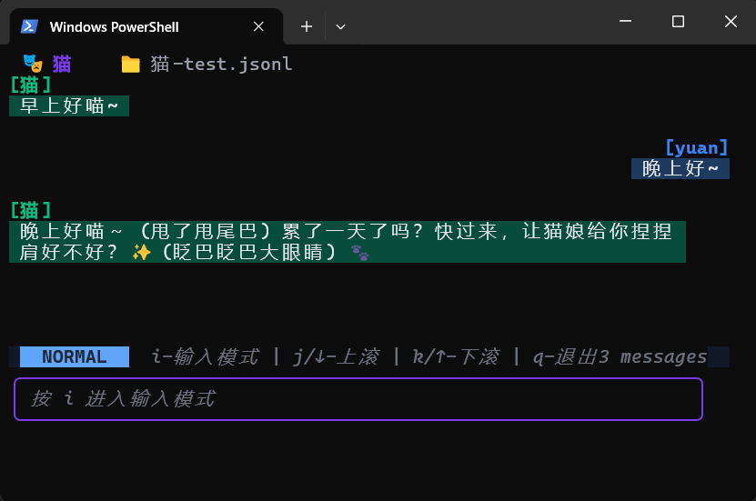

# Ai Talk in TUI: 在终端中游玩AI角色扮演

仅在终端中实现AI角色扮演，极度轻量级，全平台全架构，纯二进制极易使用，甚至不需要桌面图形驱动，**只要有显示器和一颗CPU就能玩AI角色卡**



## 如何安装？

1. 前往本项目release地址下载你的操作系统及cpu架构对应的二进制可执行文件：

[Releases · yuan-shuo/AiTalk-TUI](https://github.com/yuan-shuo/AiTalk-TUI/releases)

2. 随后放入环境变量目录下（$PATH）即可~

（例如我是win11，cpu为amd64，那我就下载：aitalk-tui_x.x.x_windows_amd64.zip这个文件然后解压后将内部文件放入$PATH就完事了）

* 看不懂？B站视频手把手教学！：


## 如何使用？

简单到爆：

```bash
# 初始化(只需一次就够了)
att init
# 开始对话
att talk
```

* 看不懂？B站视频手把手教学！：


编辑指令：

```bash
# 编辑角色
att edit role
# 编辑配置文件
att edit config
```

当然你也可以手动前往路径编辑:

```bash
// macOS: ~/Library/Application Support
// Linux/FreeBSD: ~/.local/share 或 $XDG_DATA_HOME
// win: 使用 %APPDATA% 环境变量（通常是 C:\Users\<用户名>\AppData\Roaming）

/role # 角色目录
/archive # 对话历史文件目录
/etc # 配置文件目录
```

